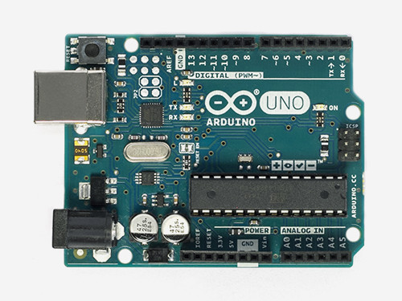
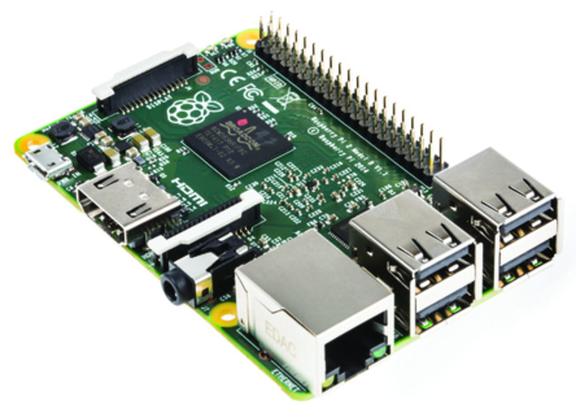
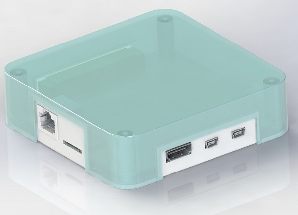
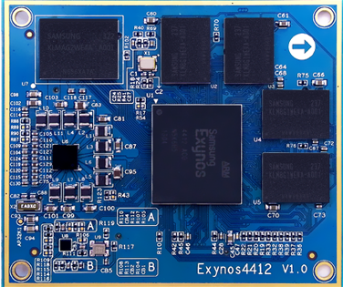
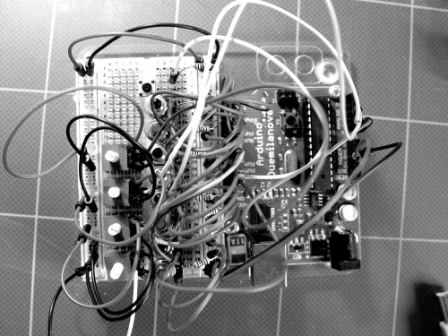
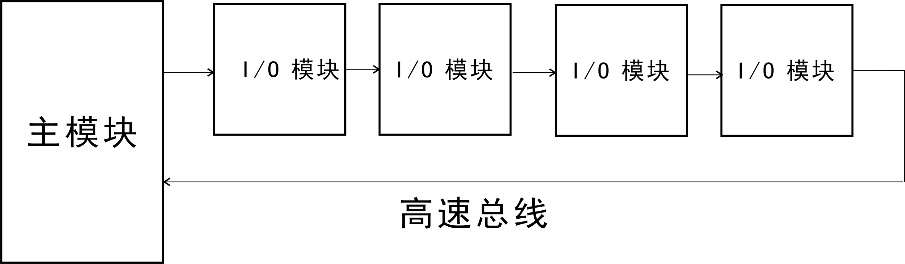

# NodeJS/javascript计算平台
 

> 我们是一群硬件工程师和嵌入式程序员，却爱上了NodeJS和Javascript。相信你也很快和我们一样爱上它。 于是我们开发了Superlogic。一个基于NodeJS/javascript的计算平台。在这个平台上，用户可以快捷地开发出各种物联网，工业控制，数据采集的应用系统。而设计者只需要会使用javascript 程序设计语言和HTML5。

这个项目它们有4部分组成：

-    Linux/NodeJS的主处理器模块。
-  一系列Superlogic I/O模块。
- 一个高速总线。
-  一个基于图形/数据流开发环境。

#  初衷
&nbsp;&nbsp;&nbsp;&nbsp;过去的十多年来，我们的团队一直开发各种嵌入式系统，非常的辛苦，一个小的应用系统也需要搭试电路，PCB设计，Keil 开发程序，jtag下载，一大堆工作。
修改应用程序往往也是非常麻烦的一件事。培养软硬件兼修的嵌入式工程师也需要很长的时间。教会了又很难留得住。  
 &nbsp;&nbsp;&nbsp;&nbsp;   伴随着不断的吐槽，我们也一直寻找一种高效率的嵌入式系统开发技术，并且降低嵌入式系统开发的学习难度。以便更多的普通工程师也能开发嵌入式系统 。  
  NodeJS 进入了我们的视线范围，NodeJS的单线程，异步，基于事件的模式和嵌入式程序的架构非常相近。  
&nbsp;&nbsp;&nbsp;&nbsp;最终，我们选择了NodeJS作为饼干控制的软件平台。  我们一开始的想法非常简单，开发一个类似ardunio这样的小电脑，模块化设计，javascript 编程。我们称它们为饼干(Biscuit)。为什么取这个名称呢，除了希望取一个耳熟能详的名称让人容易记得我们，还有一个原因是我们的系统将使用javascript 作为程序设计语言，java是印度尼西亚的爪哇岛的一种咖啡。而我们想喝咖啡必须来点饼干才是完美的下午茶。  
&nbsp;&nbsp;&nbsp;&nbsp; 没有几天，饼干系统的原型机就出来了。最早只是使用UART异步串口作为饼干之间的通信链路。在windows上的nodeJS作为主模块。开发了一个DMX512 的灯光控制器。感觉不错。
这使我们兴奋不已，终于可以摆脱繁琐的嵌入式编程，快速地开发应用系统了。于是我们决定投人更大了力量来开发更加完美的饼干系统。    
&nbsp;&nbsp;&nbsp;&nbsp;首先我们实验了各种模块连接的方式，选择了更高的速率-100M以太网。
当我们将饼干系统演示给一个资深的自动控制系统公司的老总看时，他提出了自己的担心”大多数自动控制的工程师习惯于梯形图，流程图这样的图形化编程，虽然javascript比较简单，但是他们依然不熟悉语言编程“。
&nbsp;&nbsp;&nbsp;&nbsp;于是我们又开始大量地研究了图形程序设计技术和现有的编程环境。最出名的要数NI的LabView，比较和饼干系统接近的是IBM的 NODE-RED。Labview 是一个相对完善的图形编程境，不过它主要针对NI的硬件。而且我们觉得它过度地“图形化”了，写一个简单i=i+1;都需要复杂的图形。  

我们设计了一种自己的图形编程语言，称为Superlogic。它不是基于流程图模式，而是基于数据流计算模式。  

1.	类似于硬件电路的原理图  
2. 	硬件模块，软件模块，网页组件都是以元件的形式呈现出来。正是因为这个原因，我们称之为SuperLogic 超级逻辑。     
3.	连线表示了数据的流动。
	
当我们的数据流计算图形开发环境的原型开发完成后，我们的硬件工程的第一感觉是更像FPGA的开发环境。
用户可以自己用简单的C语言就可以开发元件。无论是硬件工程师，还是控制工程师，编写一些简单的C语言小程序还是可能的。这样却大大简化了图形设计的工作量，这是一种比较好的折中方案。

数据流数据处理架构是上个世纪70年代开始提出的一种非冯洛伊曼计算机系统架构。但是这种架构并没有被广泛地得到应用。除了数据流系统开销大，难以调试等原因外。其中一个主要的原因是没有找到合适的应用场合。当计算机的处理速度逐步达到物理极限，多核处理器，多服务器架构的兴起，人们有开始关注起数据流来，希望将这种技术应用于多核。多机并行处理系统，解决大数据处理的问题，比如Google的服务器农场（Server Farm）。
同样，大数据，云计算，4G移动网，物联网，嵌入式计算 等一系列现代信息技术正在改变分布式工业控制的方式。他们逐步从功能强大，价格昂贵的硬件转向多个简单的计算节点互联。要实现这种多处理，异构网络的一个难度是协议，通信非常复杂，要在计算能力有限，带宽有限的SOC上实现协议和计算是有难度的。
在饼干控制系统中，我们设计了一个简单的数据流计算模型和引擎-Superlogic。 Superlogic 使用软件中的对象来描述数据流中的节点（我们称为对象节点Object Node ON）,使用对像属性来描述数据(Object Attributes OA)。Superlogic 引擎可以在一个普通处理器MCU上运行。也可以在分布式多处理器架构下运行。
Super logic 中的节点可以是一个物理的模块（饼干系统中的饼干），也可以是一个软件定义的虚拟的功能节点（Visual Function Node）。
为了实现与硬件无关，我们选择了NodeJS 作为Super logic 主模块的运行平台（nodeJS底层是Linux）。提出了一种为NodeJS 平台设计的可视化数据流系统设计环境的设计和数据流计算引擎实现。

# 模块化设计
  一开始，我们只是希望开发一种软/硬件模块化控制模块，使嵌入式控制系统的开发更方便和高效率。
   移动网络设备的飞速发展，促进了各种小型电子产品的诞生。在工业和家庭自动化，卫生保健和零售这些领域，有很多机会部署新的小型设备。对这些小型电子产品而言，硬件材料成本已显得微不足道，而研发成本却因为难度加大，研发人员短缺而显得越来越高。只有像手机，手表这样大众产品才可能分摊高昂的研发成本。
但是令人沮丧的是许多年来嵌入式系统开发一直是非常复杂的工作。需要阅读令人费解的各种元器件手册。使用设置非常复杂的开发环境，例如Keil C 是一个功能强大的嵌入式系统的编译工具，能够编译大多数MCU的 C语言程序。但是也正是因为如此，它的配置，使用也是令人头疼的事情。一个优秀的嵌入式程序员需要具有软件和硬件的知识和经验。
   要提高嵌入式开发的效率有两个方向，一个是模块设计，实现重复使用，二就是提高更方便的程序设计工具。
Audunio 在这方面做了努力，程序员不再使用直接操作位，端口和寄存器这样的模式了。相反使用软件的标识，关键字和函数来控制硬件了。
  

同时Ardunio开发了一个与硬件无关的开发环境。编写Ardunio程序的人可能大多数没有读过Atmel AVR的CPU手册，甚至不知道是什么MCU。
这就像我只需要食物，不必知道和关心食物是怎么做的，那个厨师做的了。软件通过代码隐藏了硬件的真实属性。
以这种方式使用表达硬件的对象在灵活性和程序安全方面有明显的好处。这不仅是低成本，高性能的处理器用于扩展应用程序设备最好的方式，也是简化开发和创建更可靠产品的方法。
另一个比较受欢迎的嵌入式模块是树莓Pi。   

尽管Ardunio，树莓PI受到了极大的欢迎，但是它们是单个MCU为核心和有限的一些I/O口的平台。当在这些平台上扩展其它的接口和芯片，程序员依然躲不过令人烦恼的过程。

现在高性能的片上系统（SOC）层出不穷。轻而易举地可以设计出一个高性能的嵌入式硬件平台。但是选择灵活，性能强大的软件平台却不是容易的事情。现在流行的方案包括了Linux 系统，Google的Andriod ， Ardunio 系统，已及最近Microsoft发布的 windows10。
但是Linux，android和windows对于控制工程师来讲，开发过于复杂。我们选择了NodeJS作为嵌入式系统的用户编程平台。

我们一直有兴趣在这方面做点事，而我们最擅长的就是通信技术，我们研究了各种的通信协议和现有的控制计算机架构。于是想到了是否能够开发一种更为大众化的，适合物联网应用的计算机平台，硬件架构上类似于工业计算机的PLC，Beckhoff 公司工业计算机那样的模块化结构和总线结构。
我们的第一步是开发了模块化硬件模块，这些模块能够灵活地结连和扩展。模块之间不像Ardunio，树莓PI那样CPU芯片级的连接，而是采用了高速总线连接。这样集成的系统是一个完整的产品，可以在工业环境下使用，而不仅仅是样机（Prototype）。
#NodeJS 和嵌入式系统#
NodeJs让javascript在服务器上运行的平台。
Javascript程序设计语言主要用于网页交互，现代浏览器都具有javaScript解释器，允许浏览器运行嵌入在网页中javascript 程序，实现动态网页效果，现在HTML5，CSS和Javascript成为了现代网页前端设计的主要工具。Google公司著名的浏览器Chrome 中的javascript 引擎叫做V8。是一个开源程序。
NodeJS是可以让javascript在服务器上运行的平台。但是它还做的更多。它可能成为桌面应用软件的平台，也可以成为手机App的平台。
NodeJS充分考虑了在实时响应，超大规模数据要求下架构的可扩展性。它摒弃了传统平台依靠多线程来实现高并发的设计思路，而采用了单线程，异步I/O，事件驱动式的程序设计模型。这些特征不仅带来了巨大的性能提高，还减少了多线程程序设计的复杂性，进而提升了开发效率。
NodeJS的Javascript引擎是Chrome中的V8。V8被称是世界上最快的javascript引擎。它的JIT的执行速度已经快到接近本地代码的执行速度。
NodeJS可以在Windows，Mac OS X，Linux等操作系统上运行。
经过一段时间的比较，我们最后选择了NodeJS作为这个物联网设备的软件平台，选择的理由是：
(1)	NodeJS的异步，事件驱动/响应式计算模型和嵌入式系统中的”中断/响应” 模式非常相似。
(2)	NodeJS支持强大的网络功能，实际上它是一个强大的网络服务器平台。
(3)	Javascript 是一个非常普及的程序设计语言，有大量javascript程序员。

NodeJS是基于事件/响应的异步方式的程序设计，数据流计算模式和nodeJS的异步模式比较吻合。
而且，我们也高兴地发现 Intel公司，IBM公司这些大牌公司也开始研发基于NodeJS的嵌入式系统开发。
 

# 主模块

## 核心模块 ##
&nbsp;&nbsp;&nbsp;&nbsp; Superlogic主处理器模块使用 三星Exynos4412,四核Cortex-A9，主频为1.6GHz。

1. 内存 2GB 双通道 DDR3  
2. 存储器 16GB
3. 图形加速 支持2D，3D图形加速ARM Mali-400 MP Core
4. HDMI 视频输出

 

## 主模块的技术指标 ##
1.   三星4412核心板
2.  一个Ethernet 接口用于模块互联
3.  一个USB接口
4.  一个USB串口
5.  一个RS485 接口

# 总线
饼干模块设计的一个突破是使用了一个高速总线来代替像Ardunio，树莓PI的芯片级的引脚。
Ardunio，树莓PI以及现在层出不穷的各种板级产品他们都是提供了引脚控制线，实现芯片级的连接控制。这样的优点是节约成本。但是也造成了连线混乱，当扩展一个电路时开发者必须直接控制芯片寄存器。
    

饼干系统采用了单一总线来代替了MCU的引脚。在模块中实现了各种I/O接口的驱动和控制。使用者通过总线协议来控制I/O接口功能。为用户屏蔽了繁琐的硬件细节。完全使用软件参数来定义和使用模块。
使用单一总线结构的另一个好处是模块可以非常简洁地构成一个功能强大的应用系统。并且可以在工业环境下长期可靠运行。
传统的模块级总线PCI总线。但是PCI对于饼干来讲太复杂了，大多数低成本的MCU不支持PCI。
在分析了各种控制总线之后，我们觉得倍福公司EtherCAT 更加适合饼干控制模块。但是EtherCAT不是一个开放的工业标准，需要使用倍福公司的ASIC 芯片来实现，尽管最近出现的一些第三方授权开发的etherCAT 收发器芯片。但是也仅限于从模块的开发。
我们决定自己开发一种更加开放，简单和低成本的控制总线和协议B-BUS。饼干总线具有下面几个特点：

1.	菊花链(Daisy-Chaining)结构的100M以太网
2.	实现软件时钟同步
3.	环型网架构
4.	响应快，传输效率高  

#  I/O 模块  
我们计划开发各种I/O 模块，它们的特点：  
1. 低成本 Cortex-M3 SOC 实现STM32F103。  
2. 具有一个Ehternet接口。  
3. PCB 尺寸：97mmX97mm
 
## 主要类型 ##
1. 数字输入模块
2. 数字输出模块
3. 4 RS485 模块·
4. 2 CAN 总线模块

# 数据流计算

现代的计算机编程技术都是以Von Neumann控制流模式为基础的。它的特点是以指令为中心，程序由一系列指令组成，预先存放在存储器中。处理器循序地读出指令，指令对数据进行计算和处理。在这里认为数据在内存的位置是不流动的。程序通过判断语句，转向语句实现了循环，跳转，程序调用实现对程序执行顺序的改变，达到对数据进行不同的计算和处理，这种程序设计方法称为存储程序式控制。
#数据流开发工具

 